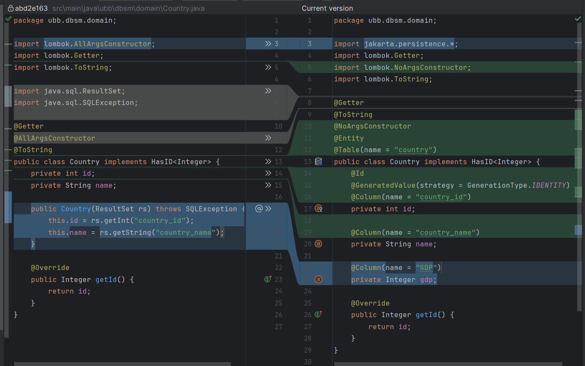
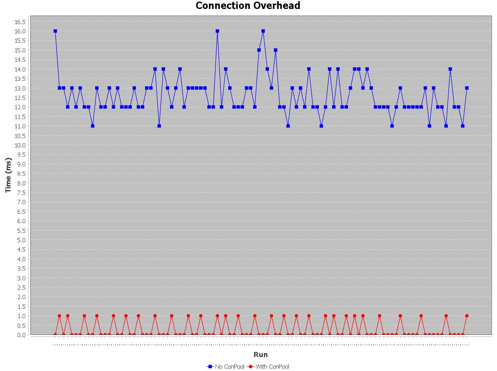

# From raw JDBC to ORM (Hibernate/JPA)

### Why would you do this in the first place?
The primary motivation for the migration was to reduce the repetitive boilerplate code typical of JDBC (connection management, manual `ResultSet` mapping, SQL exception handling) and delegate these responsibilities to a mature framework that adheres to the JPA standard.

---

## Before (JDBC) vs After (ORM)

### 2.1 Domain Classes

Migrating to JPA required adding annotations to domain classes (`@Entity`, `@Id`, `@Column`, `@ManyToOne`, etc.) and removing constructors that manually mapped `ResultSet` objects. Although the line count remain mostly the same their ware BIG changes.

| Class          | Lines Before | Lines After |
|----------------|--------------|-------------|
| `Country`      | 30           | 27          |
| `Manufacturer` | —            | —           |
| `Tank`         | —            | —           |

<p align="center">
  
</p>

The `ResultSet` constructor was eliminated entirely — Hibernate handles object instantiation and field mapping automatically via reflection.

---

### 2.2 DAO / Repository Classes

This is where the most significant reduction occurred. JDBC DAOs contained large amounts of repetitive infrastructure code: opening connections, preparing statements, iterating result sets, and closing resources. JPA replaces all of this with `EntityManager` calls.

| Class             | Lines Before | Lines After | Notes                                          |
|-------------------|--------------|-------------|------------------------------------------------|
| `CountryDAO`      | 76           | 61          | 6 of the remaining lines are logging           |
| `ManufacturerDAO` | 153          | 80          | Large reduction from removing unused functions |
| `TankDAO`         | 142          | 107         | Moderate reduction                             |

**Example — findAll() before (JDBC):**
```java
public List<Country> findAll() {
    String sql = "SELECT * FROM country";
    try (Connection conn = databaseManager.getConnection();
         PreparedStatement ps = conn.prepareStatement(sql)) {
        ResultSet rs = ps.executeQuery();
        List<Country> countries = new ArrayList<>();
        while (rs.next()) {
            countries.add(new Country(rs));
        }
        return countries;
    } catch (SQLException e) {
        throw new DatabaseError("Country findAll error: " + e.getMessage(), e);
    }
}
```

**Example — findAll() after (JPA):**
```java
public List<Country> findAll() {
    logger.debug("Fetching all countries");
    try (EntityManager em = emf.createEntityManager()) {
        List<Country> countries = em.createQuery("SELECT c FROM Country c", Country.class)
                                    .getResultList();
        logger.info("Fetched {} countries", countries.size());
        return countries;
    } catch (Exception e) {
        logger.error("Error fetching all countries", e);
        throw e;
    }
}
```

The JDBC version required manually managing the connection, statement, and result set. The JPA version delegates all of this to Hibernate, with the added benefit of structured logging.

---

## Performance Measurements

### Connection Pooling
Using connection pooling we can make our application faster by not opening a new connection to the database everytime we need to access data. Opening a connection is expensive, it involves network handshakes, authentication, and memory allocation on both sides. <br>
**HikariCP** is simply the fastest and most popular connection pool for Java. Spring Boot actually uses it by default. It works by opening a fixed number of connections at startup, when you need one it hands you an existing [connection] one from the pool and when you're done it returns it to the pool, not closes it!
<p align="center">
  
</p>

---

## Advantages and Disadvantages of ORM

### Advantages

**Dramatic reduction in boilerplate code. (it's magic)** <br>
The most visible benefit. Every JDBC DAO contained the same repetitive structure: get connection, prepare statement, execute, iterate `ResultSet`, handle `SQLException`, close everything. With JPA, this entire pattern is replaced by a single `EntityManager` call.

**Object-relational mapping is handled declaratively.** <br>
Relationships between entities (`@ManyToOne`, `@OneToMany`, etc.) are defined once in the domain class. JDBC required manually joining tables and constructing related objects from the result set on every query. JPA handles this transparently, including lazy loading of related entities when needed.

**JPQL abstracts away SQL dialect differences.** <br>
JPQL operates on entity classes and fields, not table and column names. Switching databases (e.g., from SQL Server to PostgreSQL) requires changing the dialect in `persistence.xml`, not rewriting every query.

**Detachment and merge lifecycle.** <br>
While _initially confusing (see Section 5)_, the JPA entity lifecycle (managed, detached, removed) provides a clear model for tracking which objects are synchronized with the database, reducing the risk of stale data bugs.

---

### Disadvantages

**Steep learning curve.** <br>
JPA introduces a significant number of new concepts: persistence context, entity lifecycle states, lazy vs. eager fetching, transaction management, JPQL. 

**Loss of fine-grained SQL control.** <br>
JDBC gives complete control over every SQL statement. With JPA, the developer trusts Hibernate to generate efficient queries. 

**Debugging is harder.** <br>
When something goes wrong in JDBC, the SQL statement is right there in the code. With Hibernate, the generated SQL is hidden. `hibernate.show_sql=true` helps, but interpreting why Hibernate generated a particular query requires understanding its internals.

**Configuration overhead.** <br>
Setting up JPA requires `persistence.xml`.
---

## Migration Challenges

The migration was **FUN**, but not without friction. Several issues were encountered that required debugging and conceptual adjustment.

**The no-argument constructor requirement.** <br>
Hibernate instantiates entity objects via reflection and requires a no-argument constructor on every `@Entity` class. The existing domain classes used constructors that accepted a `ResultSet` and populated fields directly, a pattern that made sense for JDBC but is entirely incompatible with JPA. All domain classes had to be refactored. <br>

A fun fact, Lombok's `@NoArgsConstructor` brakes `@Builder` and we need to add `@AllArgsConstructor`.

**Primitive types and nullable database columns.**<br>
An early runtime error revealed that Java's primitive `int` cannot hold `null`, but several database columns allowed null values. Hibernate threw a `PropertyAccessException` when attempting to map a null `GDP` column to an `int` field. The fix: use wrapper types (`Integer` instead of `int`) for any field corresponding to a nullable column.

**The detached entity problem.** <br>
Deleting an entity that was loaded in a previous `EntityManager` session resulted in an `IllegalArgumentException: Removing a detached instance`. This was because each `EntityManager` has its own persistence context, once it is closed, the entities it loaded become detached and are unknown to any new `EntityManager`. The solution was to call `em.merge(entity)` before `em.remove()`, which re-attaches the detached instance.

**Credentials and version management.** <br>
Storing database credentials in `persistence.xml` and committing it to version control was identified as a security risk. I still have to find a simple solution...