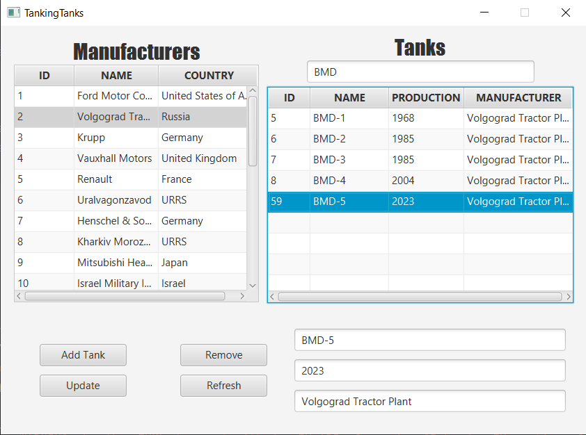

<h1>
  
  TankingTanks DBSM
</h1>

**TankingTanks** is a database system designed to store and manage user preferences about tanks.  
From tracking **favorite tanks** to storing **user ratings**, the system provides a structured way to organize and explore tank data.

This **Database System Manager (DBSM)** handles the core **CRUD operations** required to interact with the database efficiently.

## 📷 Application Preview

<p align="center">
  
</p>

### 💻 How to run
1. Create a **SQL Server database** (using SSMS) and execute the SQL script provided below to set up the schema.
2. Create a `config.properties` file inside the `resources` folder and configure it based on the example below:
```properties
# src/main/resources/config.properties
DB_URL=jdbc:sqlserver://your_pc:1344;databaseName=your_db;encrypt=true;trustServerCertificate=true
DB_USER=your_username
DB_PASS=your_password
```
3. Make sure your SQL Server instance has TCP/IP enabled and the port is set to 1344 (or modify the DB_URL to match your configured port).
4. Run the application using Gradle.

### 💾 Bare minimum code
```sql
CREATE DATABASE TankingTanks
GO
USE TankingTanks
GO

CREATE TABLE country (
	country_id INT PRIMARY KEY IDENTITY,
	country_name VARCHAR(100) NOT NULL
)

CREATE TABLE manufacturer (
    manufacturer_id INT PRIMARY KEY IDENTITY,
    manufacturer_name VARCHAR(100) NOT NULL,
    founded_year INT,
    headquarters_country_id INT FOREIGN KEY REFERENCES country(country_id)
)

CREATE TABLE tank (
	tank_id INT PRIMARY KEY IDENTITY,
	tank_name VARCHAR(100) NOT NULL,
	made_date_year INT,
	manufacturer_id INT FOREIGN KEY REFERENCES manufacturer(manufacturer_id)
	CONSTRAINT UQ_tank_manufacturer_name UNIQUE (manufacturer_id, tank_name)
)

INSERT INTO country(country_name) VALUES ('United States of America'), ('Russia'), ('Germany'), ('United Kingdom'),
('France'), ('China'), ('Japan'), ('India'), ('Israel'), ('Ukraine'), ('Poland'), ('Turkey'), ('Iran'), ('Iraq'),
('Syria'), ('Egypt'), ('Saudi Arabia'), ('North Korea'), ('South Korea'), ('Vietnam'), ('Pakistan'), ('Canada'),
('Australia'), ('Italy'), ('Finland'), ('Greece'), ('Serbia'), ('Ukraine'), ('Belarus'), ('Romania'), ('URRS');

INSERT INTO manufacturer(manufacturer_name, founded_year, headquarters_country_id) VALUES ('Ford Motor Company',1903, 1),
('Volgograd Tractor Plant', 1930, 2), ('Krupp', 1811, 3), ('Vauxhall Motors', 1857, 4), ('Renault', 1899, 5),
('Uralvagonzavod', 1936, 31), ('Henschel & Sohn', 1810, 3), ('Kharkiv Morozov Machine Building Design Bureau', 1927, 31),
('Mitsubishi Heavy Industries', 1884, 7), ('Israel Military Industries', 1933, 9), ('General Dynamics Land Systems', 1982, 1),
('Krauss-Maffei Wegmann', 1931, 3), ('Uraltransmash', 1817, 31), ('Ansaldo', 1853, 24), ('Tampella', 1861, 25),
('Military Technical Institute', 1948, 27), ('Leonida', 1943, 30), ('OKMO', 1932, 31), ('Renault', 1899, 5), ('Kirov Plant', 1801, 2),
('Detroit Arsenal', 1940, 1), ('Royal Ordnance Factory', 1930, 4), ('New South Wales Government Railways (NSWGR)', 1855, 23),
('Montreal Locomotive Works', 1888, 22), ('Hellenic Vehicle Industry', 1972, 26)

INSERT INTO tank(tank_name, made_date_year, manufacturer_id) VALUES ('M4 Sherman', 1941, 1), ('T-26', 1932, 18),
('T-36', 1940, 2), ('PT-76', 1951, 2), ('BMD-1', 1968, 2), ('BMD-2', 1985, 2), ('BMD-3', 1985, 2), ('BMD-4', 2004, 2),
('Panzer I', 1932, 7), ('Panzer II', 1934, 2), ('Panzer III', 1935, 7), ('Panzer IV', 1936, 2), ('Mk IV (A22) Churchill', 1941, 4),
('Char B1', 1921, 19), ('Char D2', 1936, 19), ('Char 2C', 1921, 19), ('Renault FT', 1917, 19), ('MS-1', 1928, 6),
('Tiger I', 1938, 7), ('Tiger II', 1943, 7), ('ISU-122', 1942, 13), ('IS-2', 1943, 20),  ('T-34', 1938, 8),
('M26 Pershing', 1942, 21), ('M60', 1956, 21), ('M1 Abrams', 1972, 21), ('MBT-70', 1965, 1), ('M48 Patton', 1952, 1),
('FV 4030 Challenger', 1983, 22), ('FV4007 (A41) Centurion', 1945, 4), ('Tiger 131', 1943, 7), ('M3 Lee', 1941, 21),
('Churchill Crocodile', 1944, 4), ('Panzer IV', 1936, 3), ('T-80', 1976, 8), ('K1', 1978, 11), ('2S3 Akatsiya', 1967, 13),
('2S19 Msta-S', 1980, 13), ('TACAM R-2', 1943, 17), ('Panzer 35', 1934, 17), ('AC4', 1943, 23), ('AC3 Thunderbolt', 1943, 23),
('P26/40', 1940, 14), ('Type 3 Chi-Nu', 1943, 9), ('Grizzly I', 1943, 24), ('Ram', 1941, 24), ('Type 97 Chi-Ha', 1936, 9),
('Merkava', 1970, 10), ('Leopard 2', 1979, 25), ('Carro Armato M13/40', 1939, 14);
```

### Design decisions
1. **Normalized Database Structure** to reduce redundancy.
2. **Composite Uniqueness for Tank Names** was introduced on `(manufacturer_id, tank_name)` to ensure that a manufacturer cannot have multiple tanks with the same name.
3. **Surrogate Primary Keys** an auto-incrementing integer ID `(IDENTITY)` as the primary key instead of natural keys. Ensures stable and efficient indexing.
4. **Configuration via `config.properties`** improves security
5. **Layered architecture**

### Challenges that I faced
1. While making this DBSM the most frequent challenge I faced was my **lack of knowledge**. From the wierd TCP/IP bugs and error I had from not knowing how to properly configure SSMS and connecting to the database... it took me so long to realise I had SQL authentication off.
2. The first problem I faced was realising that I don't know the password to the DB. That was fixed by enabling the `super admin` that for whatever reason was not enabled.
3. The second stupid problem I had was not having the TPC/IP opened on the DB. Did you know that by default is closed? I didn't. To fix this I had to go in the **`SQL Configuration Manager`**. To be able to connect to the DB I set the `IPALL` port to 1344 because when it was dynamic I couldn't connect to it... idk why?
4. I am happy for all of this because now I know, I've learned and for that I'm a better programmer.

